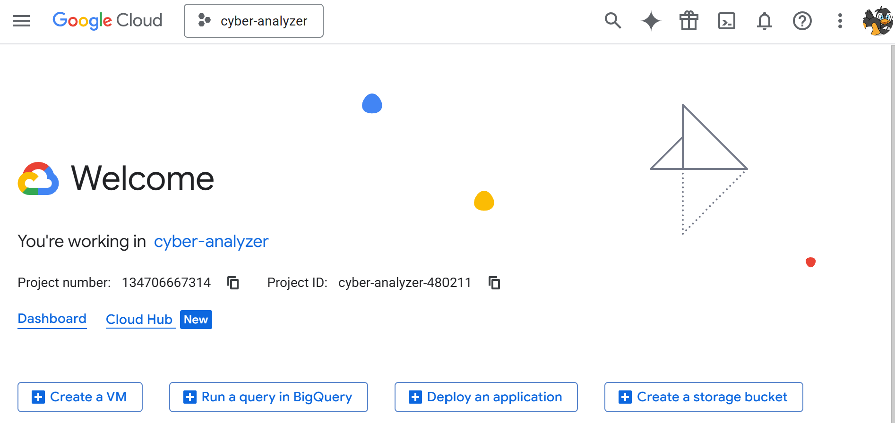

# ☁️ **LLMOps Cybersecurity Analyzer — GCP Setup Guide**

This branch covers the setup required to prepare **Google Cloud Platform (GCP)** for deploying the Cybersecurity Analyzer using **Cloud Run** and **Terraform**.
You will create a project, configure billing protections, install the gcloud CLI, and verify everything is ready for deployment.

## **Step 1: Create Your GCP Account**

### GCP Free Trial

1. Navigate to [https://cloud.google.com/free](https://cloud.google.com/free)
2. Click **"Get started for free"**
3. Sign in with your Google account (or create a new one)
4. Provide the required information:

   * Country
   * Account type: **Individual**
   * Credit card (identity check only — no auto-charging)
   * Phone verification
5. You will receive:

   * **$300 credit** valid for 90 days
   * Access to Always Free services
   * Zero automatic charges after trial ends

⚠️ **Important:** GCP will *not* charge you automatically. You must manually upgrade when the trial ends.

Once complete, you will be redirected to the Cloud Console:
[https://console.cloud.google.com](https://console.cloud.google.com)

## **Step 2: Understand GCP’s Structure**

```
Google Account (Your Gmail)
  └── Organization (optional)
      └── Billing Account (your payment method)
          └── Project (e.g., “cyber-analyzer”)
              └── Resources (Cloud Run, Artifact Registry, etc.)
```

* **Billing Account** — funds multiple projects
* **Project** — container for resources (similar to Azure Resource Groups)
* **Resources** — Cloud Run, Artifact Registry, Cloud Build, etc.

## **Step 3: Create Your GCP Project**

1. Open the Cloud Console: [https://console.cloud.google.com](https://console.cloud.google.com)
2. Click the project dropdown at the top
3. Select **NEW PROJECT**
4. Configure:

   * **Project name:** `cyber-analyzer`
   * **Organization:** default
   * **Location:** default
5. GCP will generate a unique **Project ID** (e.g., `cyber-analyzer-41519`).
   Write this down — you'll need it for CLI and Terraform.
6. Click **CREATE**
7. Ensure the new project is selected

assets/gcp/new_project.png

<p align="center">
  
</p>

🎉 Your project is ready.

## **Step 4: Set Up Billing**

1. Open the **☰ menu**
2. Select **Billing**
3. Link your billing account to the project
4. Verify your **$300 trial credit** is visible

## **Step 5: Configure Cost Management**

1. In the **☰ menu**, open **Billing**
2. Select **Budgets & alerts**
3. Click **CREATE BUDGET**
4. Use:

   * **Name:** `Monthly Training Budget`
   * **Project:** `cyber-analyzer`
5. Set:

   * **Budget amount:** `$10`
   * **Period:** Monthly
6. Alerts:

   * 50%, 90%, 100% thresholds
   * Ensure email alerts are enabled

Now you’ll receive alerts long before spending becomes an issue.

## **Step 6: Install Google Cloud CLI**

### Windows (Installer)

1. Download installer:
   [https://cloud.google.com/sdk/docs/install#windows](https://cloud.google.com/sdk/docs/install#windows)
2. Run **GoogleCloudSDKInstaller.exe**
3. Accept defaults
4. A new terminal will open automatically

### Windows (PowerShell)

```powershell
(New-Object Net.WebClient).DownloadFile("https://dl.google.com/dl/cloudsdk/channels/rapid/GoogleCloudSDKInstaller.exe", "$env:Temp\GoogleCloudSDKInstaller.exe")
& $env:Temp\GoogleCloudSDKInstaller.exe
```

### macOS (Homebrew)

```bash
brew install --cask google-cloud-sdk
```

### macOS/Linux (Direct install)

```bash
curl https://sdk.cloud.google.com | bash
exec -l $SHELL
```

### Ubuntu/Debian (APT repository)

```bash
echo "deb [signed-by=/usr/share/keyrings/cloud.google.gpg] https://packages.cloud.google.com/apt cloud-sdk main" | sudo tee -a /etc/apt/sources.list.d/google-cloud-sdk.list
curl https://packages.cloud.google.com/apt/doc/apt-key.gpg | sudo apt-key --keyring /usr/share/keyrings/cloud.google.gpg add -
sudo apt-get update && sudo apt-get install google-cloud-cli
```

## **Step 7: Initialize gcloud**

Run the initialization command:

```bash
gcloud init
```

Follow the prompts:

* Log in (browser opens automatically)
* Select your project: **cyber-analyzer**
* Choose a default region:

  * US: `us-central1` or `us-east1`
  * Europe: `europe-west1` or `europe-north1`
  * Asia: `asia-southeast1` or `asia-northeast1`

💡 **Tip:** Keep the region consistent — Cloud Run, Artifact Registry, and Cloud Build must match.

## **Step 8: Verify Your Setup**

### Using Cloud Console

1. Ensure `cyber-analyzer` is selected
2. Open **Cloud Run** from the **☰ menu**
3. You should see an empty service list (expected)

### Using gcloud

```bash
gcloud config list
gcloud projects list
gcloud config get-value project
gcloud services list --enabled
```

You should now see:

* Your project ID
* Selected region
* Enabled APIs list

### Enable Required APIs

Cloud Run deployments require:

```bash
gcloud services enable run.googleapis.com containerregistry.googleapis.com cloudbuild.googleapis.com
```

These enable:

* **Cloud Run** (deployments)
* **Container Registry / Artifact Registry** (images)
* **Cloud Build** (build + CI pipeline)